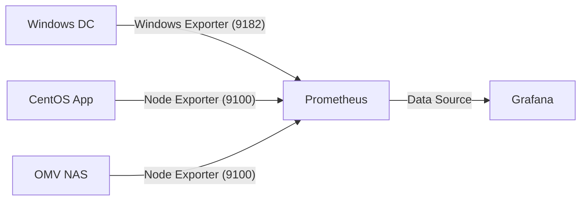

# Hybrid Cloud Lab Part 4: Enterprise Identity & Monitoring

Once your network is carved into secure segments, you need the "brains" to manage who is who and whether everything is still running. In this post, I’m covering the two pillars of my Management (VLAN 10) and Services (VLAN 20) networks: **Active Directory** and **Prometheus Monitoring**.

## Active Directory: The Identity Hub

I deployed **Windows Server 2022 (DC01)** on a tight budget of 2GB RAM. Despite the hardware constraints, it successfully handles:
- **AD DS**: Managing users and computers for the `lab.local` domain.
- **DNS**: acting as the authoritative source for the lab, with forwarders to 8.8.8.8.
- **DHCP**: Assigning IPs to devices within the management network.

The real "win" with AD was getting it to talk to the rest of the lab. Every Linux VM in my infrastructure authenticates against this domain, creating a centralized, enterprise-grade identity system.

## Centralized Monitoring with Prometheus & Grafana

You can't manage what you can't measure. I deployed a full monitoring stack on `centos-vm2` using **Podman** and **Prometheus**.

### The Monitoring Stack
- **Prometheus**: Collects and stores metrics from across the entire lab.
- **Grafana**: Provides beautiful, real-time dashboards to visualize host health.
- **Exporters**: Lightweight agents that feed data to Prometheus.

I installed **Node Exporter** on all my Linux VMs and **Windows Exporter** on the domain controller. Within minutes, I had a single pane of glass showing CPU load, memory usage, and disk I/O across my entire infrastructure.

### Why it Matters
Watching all my Prometheus targets go green for the first time was the moment this project moved from a collection of VMs to a cohesive system. It gives you the confidence to know that if a service fails, you'll see the alert before a user even notices.

In the next part, we'll cross the bridge into the cloud: setting up the **IPsec VPN** to AWS and enabling **Secure Remote Access**.

See you in Part 5!
